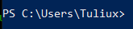

# Curso de Introducción a la Terminal y Línea de Comandos

**TERMINAL:** Interfaz gráfica que permite el ingreso de comandos, consta de un prompt que es un carácter o conjunto de caracteres que indica se esta a la espera de ordenes.

**Ejemplos de prompt:**  
El prompt en windows muestra la ruta dónde nos encontramos ubicados.  
>   

en linux nos muestra el nombre de usuario (kc) @ (localhost) nombre de maquina y la ruta dónde estamos ubicados, el ~ indica el directorio home.  
>   

En git bash se ve de la siguiente manera   
>   

y en powershell de esta otra  
> 

**SHELL:** Se refiere al interprete de comandos que utiliza la terminal, en Linux se tiene la posibilidad de cambiar a la que mejor nos convenga. Los comandos pueden variar entre interpretes.

**Ejemplos de Shell:**

+ Bash
+ Korn Shell
+ Z shell
+ Bourne Shell
+ Powershell (Windows)